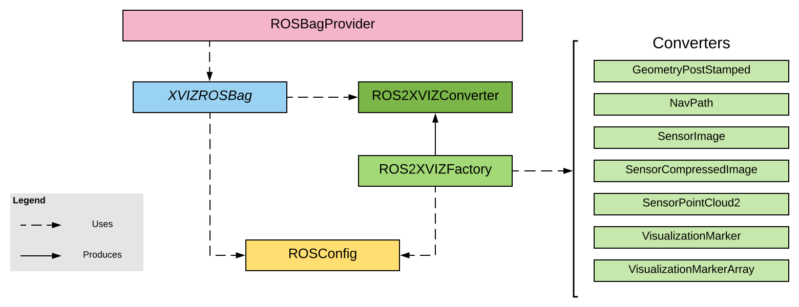

- Start Date: 2019-06-11
- RFC PR: [#?](https://github.com/uber/xviz/pull/?)
- XVIZ Issues: [#?](https://github.com/uber/xviz/issues/?)

# Summary

**@xviz/ros** will provided support for converting ROS messages into XVIZ.

This module will support the following:

 - Reading ROS Bag files
 - A configuration based conversion workflow
 - Custom message conversion
 - Off-line conversion
 - Run-time conversion

The focus will be on ROS 1, but most if not all of this translates to ROS 2 as well.

# Motivation

ROS is ubiquitous and an industry standard. AVS has a goal to progress the visualization
ecosystem for autonomous systems support which makes ROS 
support a requirement to truely deliver on our goal.

# Detailed Design

## Overview

The @xviz/ros module is ultimately striving for an automatic data-driven conversion flow.

The goal would be to build tooling that can construct a configuration to power the
conversion without any additional code being written. With that as a goal, we have design
this module around the following abilities:

 - a simple mapping of a topic to a converter
 - automatically generate the mapping using the topic message type
 - a converter registry with support for built-in and custom converters
 - simultaneously support multiple conversion configurations

While we cannot deliver completely on our goal in the initial MVP, the structure provides
for the ability to do so as we increase our ROS message support.

## Support flow

Below are descriptions, with increasing complexity, on how this module is envisioned to be used.

### Automatic

Assuming we have ROS data that works with our default converters. Use the default
[xvizserver](...) or [xvizros convert](...) command line tool to convert ROS to XVIZ
 and view in streetscape.gl

This is very limiting, due to the fact that we map every message with a supported type which
may be more data than necessary, too slow, or it may not expoe specific
fields or custom messages.

Ideally this would provide sufficient validation that the system is working and a starting
point for moving onto the next phase.

### User Configuration

We have ROS data but it requires defining a [ROSConfig](...) using [xvizros config](...)
to generate a basic configuration, then configure the topics and mapping.

Some options available in the configuration are alternative XVIZ Stream names for the viewing
application, styling, or parameters for the converter.

An example could be adding a chart for a specific metric or controlling which camera or other
sensors are extracted rather than extracting everything that matches.

### User Customization

Custom converters are required possibly due to custom topics, coordination across topics, or performance reasons.

Custom converters are registered with the [XVIZ2ROSConverter](...) and they work with the [ROSConfig](...)
if necessary to provide total control for conversion.

### Multiple ROS configuration support

Most platforms have a standard structure to their topics and custom types. Once configured that configuration
is likely all that is needed for that platform.

There are a few use-cases where the need to support multiple platforms or configurations may arise.

1. If you are a middleware vendor, then you are subject to the topics and messages of your customers.
2. If there are performance issues, you can explore alternative implementations.

This capability is supported by:

1. Defining a [ROSBag](...) subclass that can properly validate that a bag contains the expected topics.
2. Building and registering the Converters with the [ROS2XVIZFactory](...), registering
the [ROSProvider](...) along with the parameters with the [XVIZFactoryProvider](...).

The [XVIZFactoryProvider](...) will sequentially test each Provider until one is found
that supports the request.

# Classes

Below is details on the Classes and Concepts in this module.

## Converters

Converters handle the actual extraction of data from ROS message and building the of the
XVIZ messages. They inherit from [Converter](...) base class and provide the following behavior.

1. Identify themselves for explicit configuration overriding the ROS message type
2. Declaration of the primary ROS message type used to automatically map to topics
3. Generate XVIZ metadata
4. Convert messages

## ROS2XVIZ ??? ROS2XVIZConverter

[ROS2XVIZ](...) is where converters are registered and it will run the conversion by passing
the set of topics message to each converter.

## ROS2XVIZFactory

This [ROS2XVIZFactor](...) serves as a store for later creation of the [ROS2XVIZConverter](...) instance.

In order to integrate with the @xviz eco-sytem we must supply a [Provider](...). This enables
us to register multiple Providers each with a different configuration which allows us to support
ROS data from *multiple* platforms.

However this support requires that we instantiate objects later in the flow and necessitates the need for this
ROS2XVIZFactory. The factory will be passed through to the [ROSProvider](...) when the [XVIZProviderFactory](...) is
searching for a Provider to support a particular request.

## ROSConfig

The [ROSConfig](...) is a simple data mapping that provides the topics to be read and the ability to control
the mapping of a topic to a converter.

## ROSBag

This [ROSBag](...) provides access to the ROS data. It provides access to the topics, message types, and messages. It is used by
the the [ROSProvider](...).

One critical aspect to the ROSBag is the [initialization](...) which determines if a particular bag
can be supported. As platforms can choose arbitrary topics and create custom messages, it is useful to
validate the presence of a particular topic to validate support.  Users can subclass the ROSBag and
override the [\_initBag](...) function to perform this validation.

The [ROSBag](...) also provides the method [\_initMetadata](...) useful to augment the metadata generated.

## ROSProvider

The [ROSProvider](...) is the high-level object to actually access the generated XVIZ data.

## Future Plans

# Expanding the configuration 

By expanding the ROSConfig we can do more with config-only workflows.

# Generic mapping

Building upon the above, we can parametersize converters and create generic instances
to extract and map data to XVIZ types. These are not ROS Message based but rather message field based.

# Additional messages

Expand supported messages and improve the range of support for the current messages.

# ROS2

ROS2 still sends messages, so an appropriate replacement for [rosbag.js](...)
that supports ROS2 data should allow the rest of this module to work.
